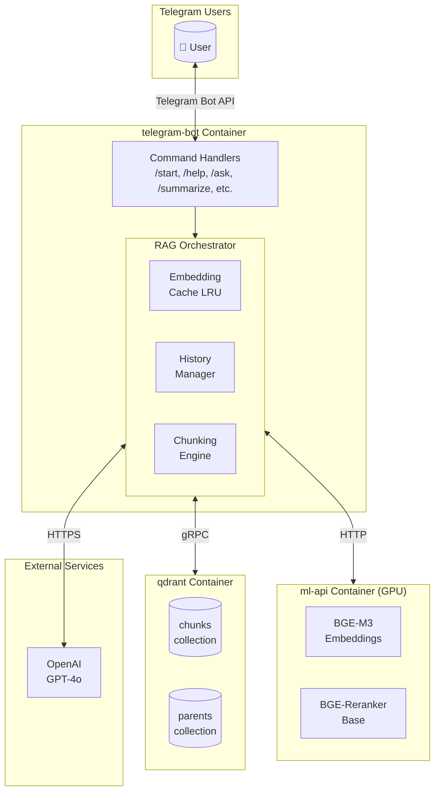
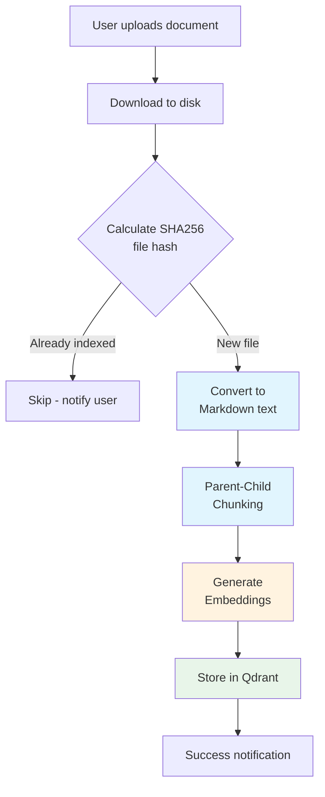
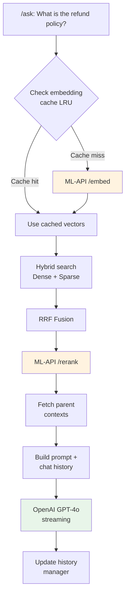
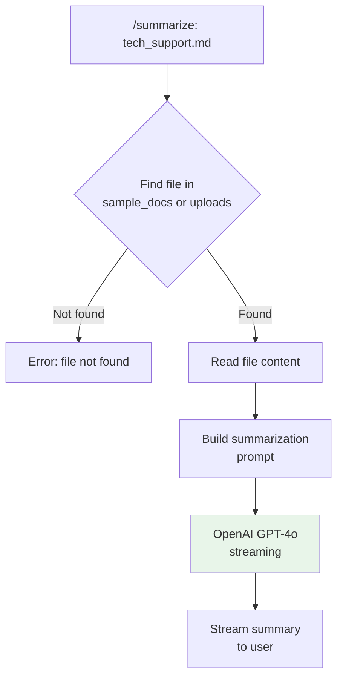

# Architecture

This document describes the technical architecture, design decisions, and data flow of the Telegram RAG Chatbot.

## System Overview

The application implements a modular, containerized Retrieval-Augmented Generation (RAG) system designed for Telegram integration. It follows a microservices pattern with three main components:



## Components

### 1. Telegram Bot (`telegram-bot/`)

The main application handling user interactions via Telegram.

| Module | Purpose |
|--------|---------|
| `handlers/` | Command handlers (`/start`, `/help`, `/ask`, `/summarize`, etc.) |
| `rag/orchestrator.py` | Coordinates the RAG pipeline |
| `rag/cache.py` | LRU cache for query embeddings |
| `chunking/engine.py` | Parent-child hierarchical chunking |
| `database/qdrant_client.py` | Qdrant vector database operations |
| `services/ml_api_client.py` | HTTP client for ML-API |
| `models/model_factory.py` | OpenAI provider abstraction |
| `utils/history.py` | Per-user conversation history |

### 2. ML-API (`ml-api/`)

Dedicated FastAPI microservice for compute-intensive ML inference.

**Endpoints:**

| Endpoint | Method | Description |
|----------|--------|-------------|
| `/embed` | POST | Generate BGE-M3 embeddings (dense + sparse) |
| `/rerank` | POST | Score documents with BGE-Reranker |
| `/health` | GET | Health check |

**Design Rationale:**

- **Independent Scaling** - GPU-heavy service scales separately from lightweight bot
- **Resource Isolation** - Dedicated GPU memory management
- **Simplified Dependencies** - Bot doesn't require PyTorch/CUDA stack

### 3. Qdrant Vector Database

Stores document embeddings for semantic retrieval.

| Collection | Purpose |
|------------|---------|
| `chunks` | Child chunks with dense + sparse vectors |
| `parents` | Parent chunks (context source, no vectors) |

## Data Flow

### Document Ingestion



**Chunking Strategy:**
- Uses MarkItDown for format conversion (PDF, DOCX, etc.)
- Headers create semantic boundaries for parent chunks
- Children: ~384 tokens with 64-token overlap
- Parents: ~1200 tokens for complete context

### RAG Query Pipeline



### Document Summarization



## Design Decisions

### Parent-Child Chunking

Instead of flat chunking, the system uses a two-level hierarchy:

| Level | Token Size | Purpose |
|-------|------------|---------|
| Parent | ~1200 | Full sections with complete context |
| Child | ~384 | Overlapping retrieval targets |

**Benefits:**
- Children are small enough for precise retrieval
- Parents provide complete context to the LLM
- Reduces hallucination from fragmented context

### Hybrid Search with RRF

Combines dense and sparse vectors for optimal retrieval:

1. **Dense vectors (BGE-M3)** - Semantic similarity matching
2. **Sparse vectors (BM25-style)** - Exact keyword matching

**Reciprocal Rank Fusion (RRF)** combines both rankings:

```
RRF_score = Σ 1 / (k + rank_i)
```

This captures both semantic meaning AND exact term matches, improving retrieval quality.

### Embedding Cache

LRU cache for query embeddings:

| Property | Value |
|----------|-------|
| Key | MD5 hash of normalized query |
| Value | Dense + sparse vectors |
| Default Size | 1000 entries |

**Benefits:**
- Repeated queries skip ML-API call entirely
- Significant latency reduction for common queries
- Configurable via `EMBEDDING_CACHE_SIZE`

### Conversation History

Per-user message history maintained in-memory:

| Property | Value |
|----------|-------|
| Storage | Python dict (in-memory) |
| Retention | Last 3 turns per user |
| Persistence | None (clears on restart) |

**Production Enhancement:** Could be persisted to Redis for durability.

## API Reference

### ML-API Endpoints

#### POST /embed

Generate embeddings for text(s).

**Request:**
```json
{
  "text": ["document text", "another text"],
  "is_query": false
}
```

**Response:**
```json
{
  "dense_vecs": [[0.1, 0.2, ...], [0.3, 0.4, ...]],
  "sparse_vecs": [{"123": 0.5, "456": 0.3}, {...}],
  "latency_ms": 45.2,
  "batch_size": 2
}
```

#### POST /rerank

Rerank documents by relevance to query.

**Request:**
```json
{
  "query": "refund policy",
  "documents": ["doc1 text", "doc2 text"],
  "top_k": 5
}
```

**Response:**
```json
{
  "results": [
    {"index": 1, "score": 0.95, "document": "doc2 text"},
    {"index": 0, "score": 0.72, "document": "doc1 text"}
  ],
  "latency_ms": 23.1,
  "batch_size": 2
}
```

## Security Considerations

| Concern | Mitigation |
|---------|------------|
| API Keys | Stored in `.env`, excluded from version control |
| File Uploads | Size limit (10MB), extension whitelist |
| User Data | In-memory only (clears on restart) |
| Network | Internal Docker network isolates services |

## Scalability

### Current Limitations

- Single bot instance (Telegram polling mode)
- In-memory cache and conversation history
- Single Qdrant instance

### Production Enhancements

| Component | Enhancement |
|-----------|-------------|
| Bot | Webhook mode + load balancer |
| Cache | Redis cluster |
| History | PostgreSQL or Redis |
| Qdrant | Cluster mode with replication |
| ML-API | Horizontal scaling behind load balancer |

## Configuration Reference

| Variable | Default | Description |
|----------|---------|-------------|
| `TELEGRAM_TOKEN` | - | Bot token from @BotFather |
| `OPENAI_API_KEY` | - | OpenAI API key |
| `DEFAULT_MODEL` | `gpt-4o` | LLM model identifier |
| `QDRANT_URL` | `localhost:6333` | Qdrant server URL |
| `ML_API_URL` | `localhost:8001` | ML-API server URL |
| `EMBEDDING_CACHE_SIZE` | `1000` | Max cached embeddings |
| `MAX_HISTORY_TURNS` | `3` | Conversation turns to keep |
| `HTTP_TIMEOUT` | `120.0` | HTTP request timeout (seconds) |
