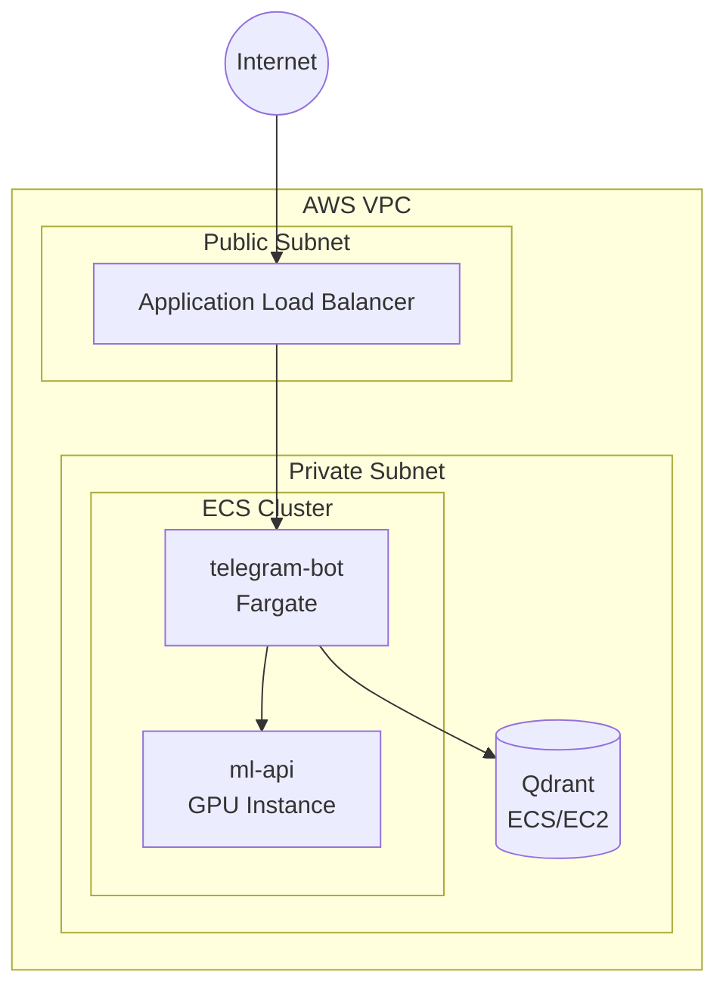

# Deployment Guide

This document covers production deployment strategies for the Telegram RAG Chatbot.

## Deployment Overview

The system consists of three containerized services:

| Service | Resource Requirements | Scaling Considerations |
|---------|----------------------|------------------------|
| telegram-bot | Low (CPU-bound) | Single instance (polling mode) |
| ml-api | High (GPU required for production) | Horizontal scaling possible |
| qdrant | Medium (storage-bound) | Cluster mode for high availability |

## Pre-Deployment Checklist

- [ ] Valid Telegram Bot Token configured
- [ ] Valid OpenAI API Key with sufficient credits
- [ ] GPU available for ML-API (or CPU fallback accepted)
- [ ] Persistent storage for Qdrant data
- [ ] Environment variables secured (not in source control)

## Container Registry Setup

Before deploying, push container images to a registry:

```bash
# Build images
docker-compose build

# Tag for registry (example: Docker Hub)
docker tag telegram-rag-bot:latest youruser/telegram-rag-bot:latest
docker tag ml-api-telegram-rag:latest youruser/ml-api-telegram-rag:latest

# Push
docker push youruser/telegram-rag-bot:latest
docker push youruser/ml-api-telegram-rag:latest
```

## Deployment Strategies

### Option 1: Fly.io (Recommended for Simplicity)

Fly.io offers straightforward container deployment with GPU support.

**Prerequisites:**
- [flyctl](https://fly.io/docs/hands-on/install-flyctl/) installed
- Fly.io account

**Deployment Steps:**

1. **Initialize Fly app:**
   ```bash
   fly launch --no-deploy
   ```

2. **Configure secrets:**
   ```bash
   fly secrets set TELEGRAM_TOKEN=your-token
   fly secrets set OPENAI_API_KEY=sk-your-key
   ```

3. **Create `fly.toml`:**
   ```toml
   app = "telegram-rag-bot"
   primary_region = "ord"

   [build]
     dockerfile = "telegram-bot/Dockerfile"

   [env]
     QDRANT_URL = "http://qdrant.internal:6333"
     ML_API_URL = "http://ml-api.internal:8001"

   [[services]]
     internal_port = 8080
     protocol = "tcp"
   ```

4. **Deploy:**
   ```bash
   fly deploy
   ```

**Note:** For ML-API with GPU, use Fly.io Machines with GPU allocation:
```bash
fly machine create --vm-gpu-kind a100-pcie-40gb
```

### Option 2: Render

Render provides managed Docker deployments with straightforward GPU support.

**Deployment Steps:**

1. **Connect repository** to Render dashboard

2. **Create services:**
   - **Qdrant**: Docker service from `qdrant/qdrant:latest`
   - **ML-API**: Docker service from `ml-api/Dockerfile`
   - **Telegram Bot**: Docker service from `telegram-bot/Dockerfile`

3. **Configure environment variables** in Render dashboard

4. **Set up private networking** between services

**GPU Configuration:**
Select an instance type with GPU (e.g., `gpu-p100`) for the ML-API service.

### Option 3: AWS (ECS/EKS)

For enterprise deployments with full control.

**Architecture:**



**ECS Task Definition (telegram-bot):**
```json
{
  "family": "telegram-rag-bot",
  "containerDefinitions": [{
    "name": "telegram-bot",
    "image": "youruser/telegram-rag-bot:latest",
    "essential": true,
    "environment": [
      {"name": "QDRANT_URL", "value": "http://qdrant:6333"},
      {"name": "ML_API_URL", "value": "http://ml-api:8001"}
    ],
    "secrets": [
      {"name": "TELEGRAM_TOKEN", "valueFrom": "arn:aws:secretsmanager:..."},
      {"name": "OPENAI_API_KEY", "valueFrom": "arn:aws:secretsmanager:..."}
    ]
  }],
  "requiresCompatibilities": ["FARGATE"],
  "cpu": "512",
  "memory": "1024"
}
```

**ML-API GPU Instance:**
- Use `p3.2xlarge` or `g4dn.xlarge` EC2 instances
- Install NVIDIA Container Toolkit
- Run ML-API container with GPU passthrough

### Option 4: GCP (Cloud Run + GKE)

**Cloud Run (for telegram-bot):**
```bash
gcloud run deploy telegram-rag-bot \
  --image gcr.io/your-project/telegram-rag-bot \
  --set-env-vars QDRANT_URL=http://qdrant:6333 \
  --set-secrets TELEGRAM_TOKEN=telegram-token:latest \
  --platform managed
```

**GKE (for ml-api with GPU):**
```yaml
apiVersion: apps/v1
kind: Deployment
metadata:
  name: ml-api
spec:
  replicas: 1
  template:
    spec:
      containers:
      - name: ml-api
        image: gcr.io/your-project/ml-api
        resources:
          limits:
            nvidia.com/gpu: 1
      nodeSelector:
        cloud.google.com/gke-accelerator: nvidia-tesla-t4
```

## Production Considerations

### Webhook Mode (Recommended for Production)

Switch from polling to webhook for better reliability:

```python
# In telegram-bot/app/main.py, modify run() method:
async def run(self) -> None:
    app = self.create_application()
    
    # Webhook configuration
    await app.bot.set_webhook(
        url="https://your-domain.com/webhook",
        secret_token=os.environ.get("WEBHOOK_SECRET")
    )
    
    # Start webhook server
    await app.run_webhook(
        listen="0.0.0.0",
        port=8443,
        secret_token=os.environ.get("WEBHOOK_SECRET"),
        webhook_url="https://your-domain.com/webhook"
    )
```

### Persistent Storage

**Qdrant Data:**
- Mount persistent volume for `/qdrant/storage`
- Configure backup strategy for vector data

**Model Cache:**
- ML-API downloads models on first start (~2GB)
- Mount persistent volume for `/models_cache` to avoid re-downloads

### Monitoring

**Health Checks:**
- ML-API: `GET /health`
- Qdrant: `GET /healthz`
- Telegram Bot: Import test (see Dockerfile HEALTHCHECK)

**Metrics (Future Enhancement):**
- Prometheus metrics endpoint
- Grafana dashboards for cache hit rates, query latency

### Security Hardening

1. **Secrets Management:**
   - Use cloud provider's secrets manager
   - Never commit secrets to version control

2. **Network Isolation:**
   - Internal services on private network
   - Only expose Telegram webhook endpoint

3. **Container Security:**
   - Run as non-root user (already configured)
   - Use minimal base images
   - Scan images for vulnerabilities

### Cost Optimization

| Component | Cost Driver | Optimization |
|-----------|-------------|--------------|
| ML-API | GPU instance | Use spot instances, auto-shutdown when idle |
| Qdrant | Storage size | Prune old/unused collections |
| OpenAI | API calls | Cache responses, limit max_tokens |

## Environment Variables Reference

| Variable | Required | Production Notes |
|----------|----------|------------------|
| `TELEGRAM_TOKEN` | Yes | Store in secrets manager |
| `OPENAI_API_KEY` | Yes | Store in secrets manager |
| `DEFAULT_MODEL` | No | Use `gpt-4o` for best results |
| `QDRANT_URL` | Yes | Use internal service URL |
| `ML_API_URL` | Yes | Use internal service URL |
| `EMBEDDING_CACHE_SIZE` | No | Increase for high-traffic deployments |
| `MAX_HISTORY_TURNS` | No | Keep low (3) to reduce context size |
| `HTTP_TIMEOUT` | No | Increase if ML-API is slow |

## Rollback Strategy

1. **Container Versioning:**
   ```bash
   docker tag youruser/telegram-rag-bot:latest youruser/telegram-rag-bot:v0.1.0
   ```

2. **Database Backups:**
   - Snapshot Qdrant storage before updates
   - Test new versions with separate collection

3. **Feature Flags:**
   - Use environment variables for gradual rollout
   - Test new features with subset of users
