# Telegram RAG Chatbot

A production-ready Telegram bot with **Retrieval-Augmented Generation (RAG)** capabilities for intelligent document Q&A.

## What It Does

This project implements a Telegram bot that transforms uploaded documents into a searchable knowledge base. Users can ask natural language questions and receive accurate, source-cited answers powered by state-of-the-art ML models.

| Capability | Description |
|------------|-------------|
| **Document Ingestion** | Upload PDF, TXT, MD, DOCX, EPUB files directly via Telegram |
| **Intelligent Chunking** | Parent-child hierarchical splitting preserves document context |
| **Hybrid Search** | Combines dense (semantic) + sparse (keyword) retrieval with RRF fusion |
| **Semantic Reranking** | BGE-Reranker ensures highest-quality results |
| **Streaming Responses** | Real-time answer generation with source citations |
| **Conversation Memory** | Maintains context across multiple conversation turns |

## Architecture Overview

The system follows a microservices pattern with three containerized components:

```mermaid
flowchart TB
    subgraph Users["Telegram Users"]
        User[("👤 User")]
    end

    subgraph Bot["telegram-bot Container"]
        Handlers[Command Handlers]
        RAG[RAG Orchestrator]
        Cache[Embedding Cache]
        Chunking[Chunking Engine]
    end

    subgraph ML["ml-api Container"]
        Embed["BGE-M3 Embeddings"]
        Rerank["BGE-Reranker"]
    end

    subgraph Storage["qdrant Container"]
        Chunks[(Chunks Collection)]
        Parents[(Parents Collection)]
    end

    subgraph External["External APIs"]
        OpenAI["OpenAI GPT-4o"]
    end

    User <-->|Telegram API| Handlers
    Handlers --> RAG
    RAG --> Cache
    RAG --> Chunking
    RAG --> ML
    RAG --> Storage
    RAG --> OpenAI
    ML --> Embed
    ML --> Rerank
```



## Project Structure

```
.
├── telegram-bot/               # Main Telegram bot application
│   ├── app/
│   │   ├── handlers/           # /start, /help, /ask, /summarize, etc.
│   │   ├── rag/                # RAG pipeline (orchestrator, cache)
│   │   ├── chunking/           # Parent-child document chunking
│   │   ├── database/           # Qdrant vector database client
│   │   ├── models/             # LLM provider abstraction (OpenAI)
│   │   ├── services/           # ML-API HTTP client
│   │   └── utils/              # Conversation history manager
│   ├── sample_docs/            # Pre-loaded sample documents
│   ├── tests/                  # Comprehensive test suite
│   └── Dockerfile
├── ml-api/                     # GPU-accelerated ML service
│   ├── ml_api.py               # FastAPI embeddings + reranking
│   └── Dockerfile
├── docker-compose.yml          # Full-stack orchestration
└── docs/
    ├── QUICKSTART.md           # Setup and installation guide
    ├── ARCHITECTURE.md         # Technical deep-dive
    └── DEPLOYMENT.md           # Production deployment guide
```

## Quick Start

```bash
# 1. Clone and configure
git clone <repository-url>
cd telegram-rag-chatbot
cp .env.example .env
# Edit .env with your credentials

# 2. Run with Docker Compose
docker-compose up --build
```

The bot requires:
- **Telegram Bot Token** (from [@BotFather](https://t.me/BotFather))
- **OpenAI API Key** (for GPT-4o)

See [QUICKSTART.md](QUICKSTART.md) for detailed setup instructions.

## Bot Commands

| Command | Description |
|---------|-------------|
| `/start` | Welcome message and onboarding |
| `/help` | Usage instructions and tips |
| `/ask <question>` | Ask a question about indexed documents |
| `/summarize <file>` | Generate a concise summary of a document |
| `/files` | List all indexed documents |
| `/stats` | View cache and history statistics |
| `/clear` | Clear your conversation history |

**File Upload:** Send any supported document directly to the bot for automatic indexing.

## Technology Stack

| Component | Technology |
|-----------|------------|
| Bot Framework | [python-telegram-bot](https://python-telegram-bot.org/) 22.x |
| Vector Database | [Qdrant](https://qdrant.tech/) |
| Embeddings | [BGE-M3](https://huggingface.co/BAAI/bge-m3) (1024-dim dense + sparse) |
| Reranking | [BGE-Reranker-Base](https://huggingface.co/BAAI/bge-reranker-base) |
| LLM | OpenAI GPT-4o |
| Package Manager | [uv](https://github.com/astral-sh/uv) |

## Documentation

| Document | Purpose |
|----------|---------|
| [QUICKSTART.md](QUICKSTART.md) | Installation and setup guide |
| [ARCHITECTURE.md](ARCHITECTURE.md) | System design and data flow |
| [DEPLOYMENT.md](DEPLOYMENT.md) | Production deployment strategies |
| [ROADMAP.md](ROADMAP.md) | Project milestones and future plans |
| [CONTRIBUTING.md](CONTRIBUTING.md) | Contribution guidelines |
| [CHANGELOG.md](CHANGELOG.md) | Version history |

## Development

```bash
# Navigate to bot directory
cd telegram-bot

# Install dependencies with uv
uv sync --dev

# Activate virtual environment
.venv/Scripts/Activate.ps1  # Windows
# source .venv/bin/activate  # Linux/Mac

# Run tests
pytest tests/ -v --cov=app

# Code quality
ruff check app/
ruff format app/
mypy app/
```

## License

This project is licensed under the MIT License. See [LICENSE](LICENSE) for details.
